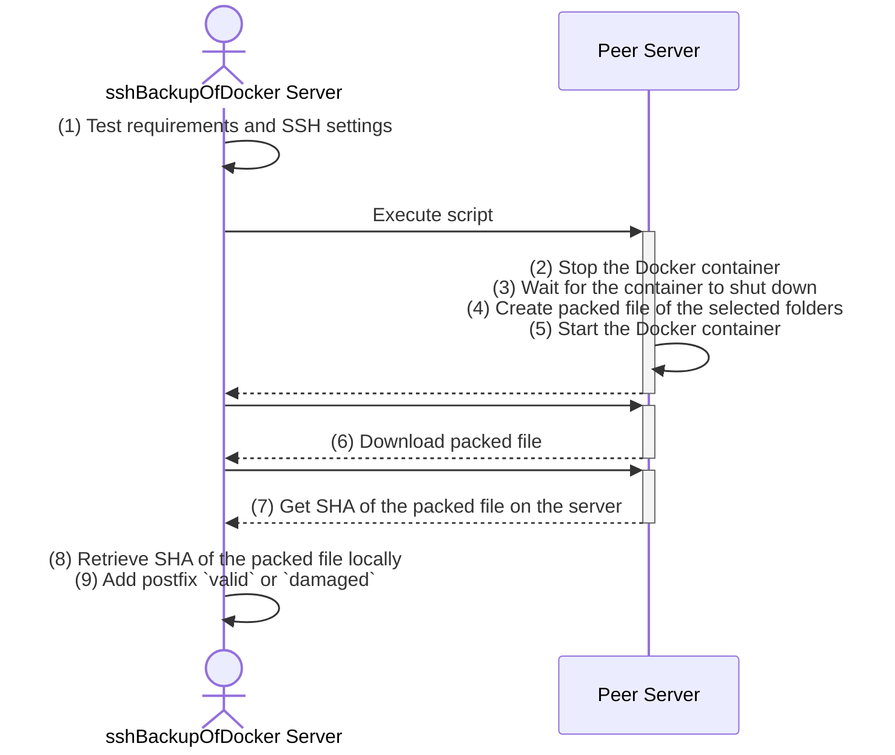

# SshBackupOfDocker

The repo creates a backup of folders from a remote server and downloads the archive. The main task is to create a backup of a Docker container. An encrypted private key file is used for the login. All data and settings are saved externally in a json file so that the script can remain unchanged while the configuration file is changed.

The script has a `-h` and `--help` switch. These switches provide you with all the necessary information about switches and return values.

## Steps in the script

